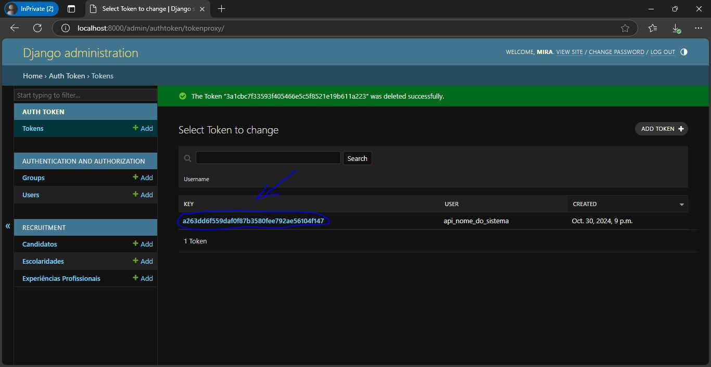

> ***Pré requisitos***: Estar com o projeto rodando 

Siga os seguintes passos


1. Va na url do django admin 

```url
http://localhost:8000/admin/
```

Se voce ainda não fez o login com seu Super Usuario ele ira pedir para que voce logue.
>Como criar o super usuario volte na documentação do [docker](./DOCKER)

 


-----------------------------------------------
2. Criar um usuario para a api


clique em add para criar um novo usuario


 

  
-----------------------------------------------


3. Crie o usuario

  


---------------------------------------------


4. Volte a Tela Inicial 
    

volte a tela inicial e clicke em add tokem


   

--------------------------------------------


5. Selecione o Usuario


selecione o usario que voce criou e clicke em save  


   

------------------------------------------


6. Criando o Token

   
copie o tokem que voce acabou de criar (esta selecionado em azul na imagem abaixo)


   


---------------------------------------------


7. adicione o tokem criado 


Vá no sistema que voce ira usar e cole o token que voce acabou de criar(aqui estou usando o isominia para exemplificar)

   


---------------------------------------------


Pronto aqui o seu sitema ja consegue acessar as apis deste sistema, as urls de api's estao aqui em baixo 
    
```H
"http://localhost:8000/recruitment/api/candidates/"
"http://localhost:8000/recruitment/api/users/"

#api das experiencias 
"http://localhost:8000/recruitment/api/candidates/{id_candidato}experiences"
"http://localhost:8000/recruitment/api/candidates/{id_candidato}experiences/{id_experiencia}"

#api das Formações
"http://localhost:8000/recruitment/api/candidates/{id_candidato}educations"
"http://localhost:8000/recruitment/api/candidates/{id_candidato}educations/{id_educations}"


```

