> ***Pré requisitos***: Estar com o projeto rodando

# Manual da Interface 
Aqui irei te explicar como o sistema funciona e como funciona a interface grafica 


## Passo a Passo
1. ### Com o seu projeto rodando no seu navegador acesse a url 
    ```H
        http://localhost:8000
    ```
     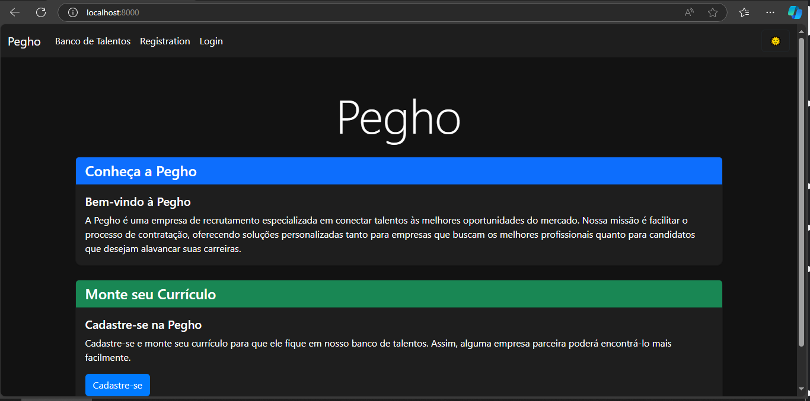
    #### aqui voce esta na pagina inicial do site você ira  precisar se cadastrar no site para começar a criar seu   curriculo.

--------------------------------------------------

2. ### Crie seu usuario 

    #### prencha os campos e clicke em salvar
    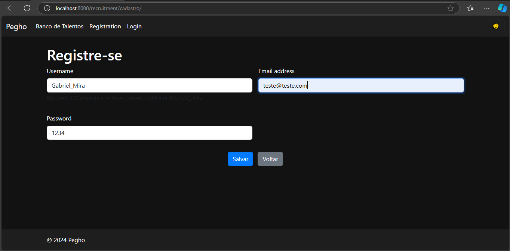

--------------------------------------------------

3. ### Faça o login

    #### Prencha os campos com o seu nome de usuario e sua senha depois click em entrar 
     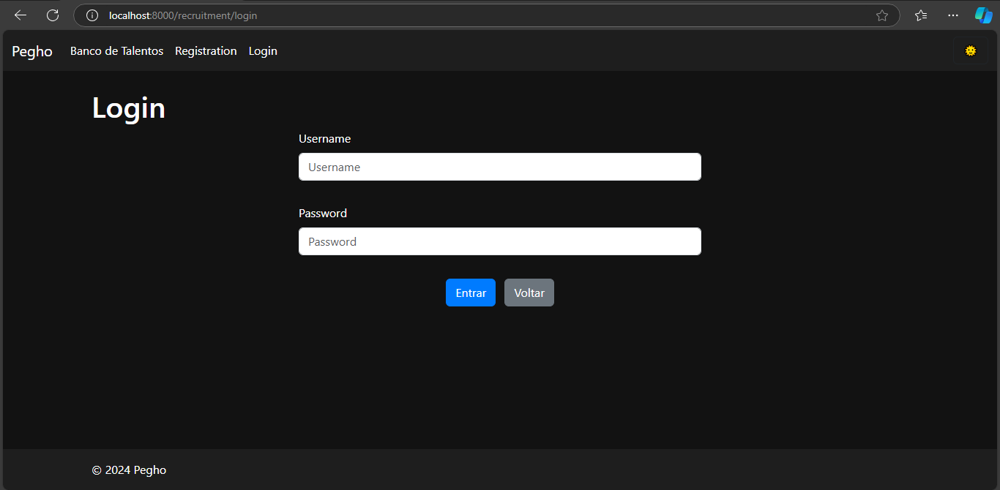

--------------------------------------------------

4. ### Pagina inicial do Banco de Talentos.

    #### Aqui você tem ira iniciar a criação do seu curriculo
     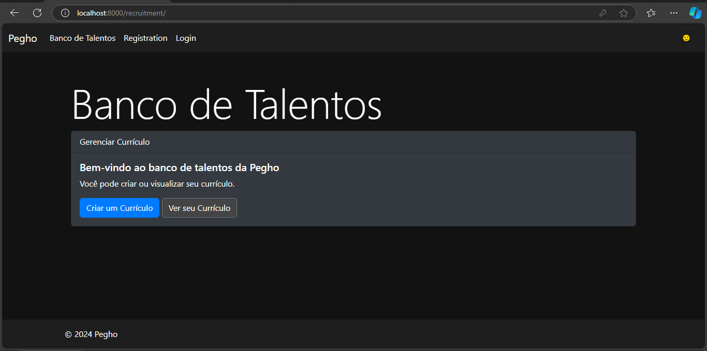
     #### clique em Criar Curriculo

--------------------------------------------------

5. ### Pagina Para Criar o Candidato

    #### Complete o formulario com seus dados pessoais
     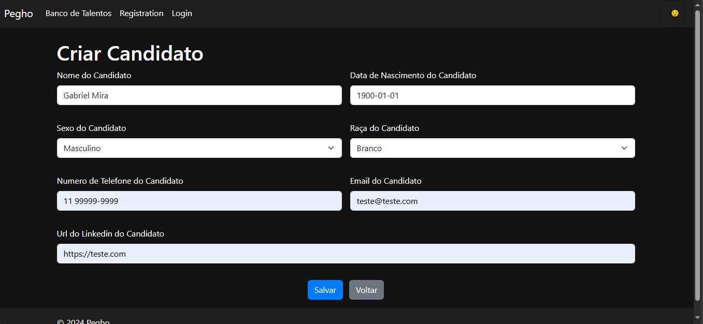 
    #### Clique em salvar 

--------------------------------------------------

6. ### Pagina do Curriculo

    #### Aqui você já esta vendo seu curriculo, nesta Pagina voce pode adicionar uma Formção Academica ou uma experiência profissional ou editar seus dados pessoais.
     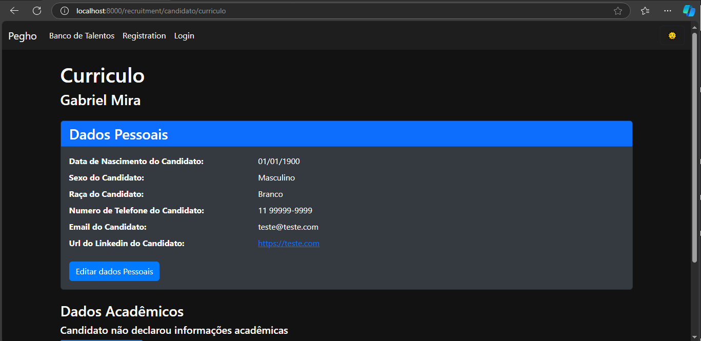

--------------------------------------------------

7. ### Adicionando uma formação Acadêmica

    #### Nesta pagina voce irá adicionar uma formação academica 
     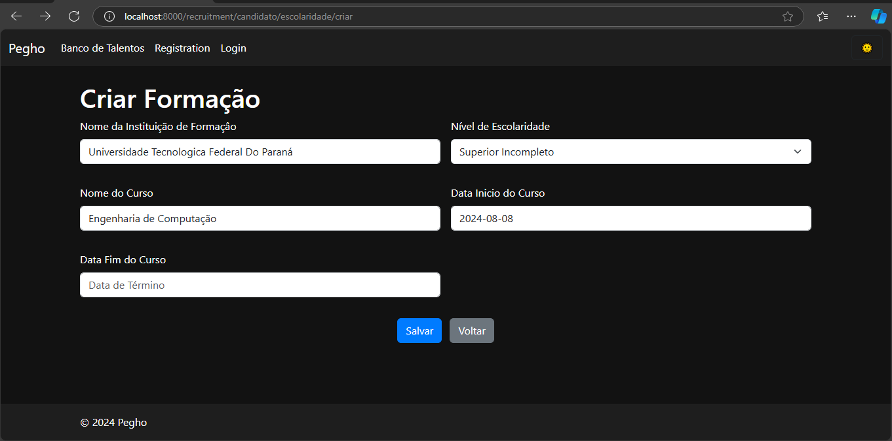
    #### Prencha os dados da Formação Academica que deseja adicionar e clique em salvar 

------------------------------------------------

8. ### Adicionando Expêriencia Profissional
    #### Nesta pagina voce irá adicionar uma formação academica
     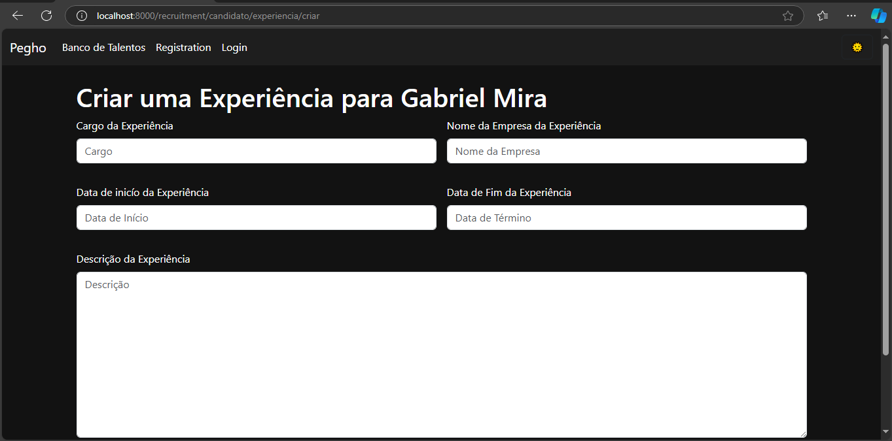
    #### Preencha o formulario e clike em salvar 

-----------------------------------------------

9. ### Curriculo Pronto 

    #### Após adicionar as suas Formações e suas Experiências a págiana do seu curriculo ficará assim 
     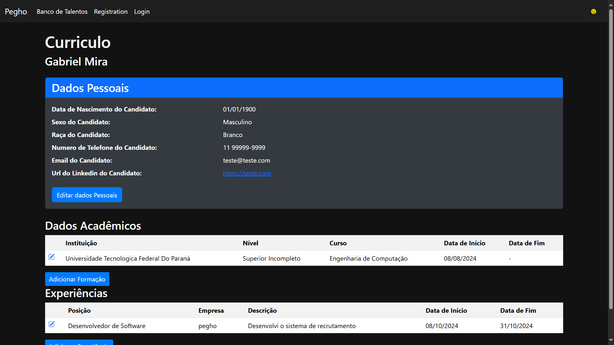
    #### Aqui voce esta vendo o seu curriculo completo com suas experiencicas.

-----------------------------------------------

10. ### Editar suas informações 

    #### Para editar suas informações va no seu curriculo clike em editar informções. voce sera redirecionado para essa pagina 
    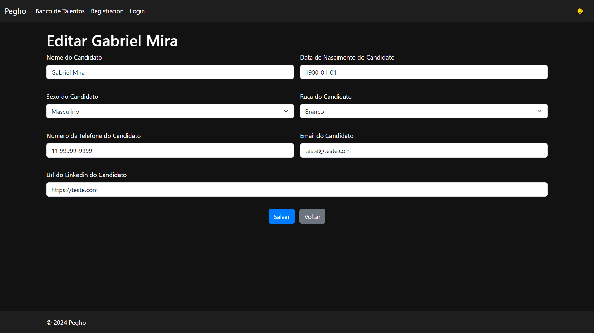  
    #### edite suas informações e clicke em salvar 

------------------------------------------------


11. ### Editar suas Formações 

    #### Para editar suas formações va no seu curriculo clike em no icone de editar. voce sera redirecionado para essa pagina 
    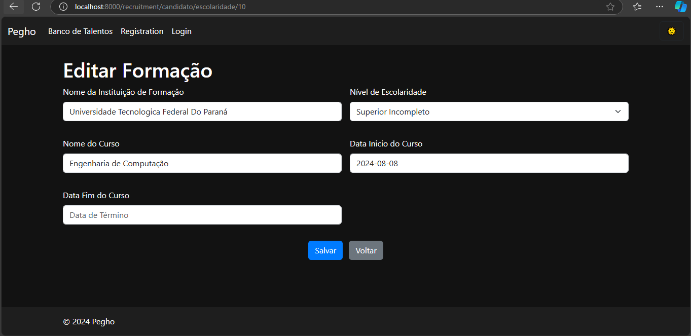  
    #### edite suas Formações e clicke em salvar

------------------------------------------------


12. ### Editar suas Experiencias 

    #### Para editar suas Experiencias va no seu curriculo clike em no icone de editar. voce sera redirecionado para essa pagina 
      
    #### edite suas Experiencias e clicke em salvar

------------------------------------------------